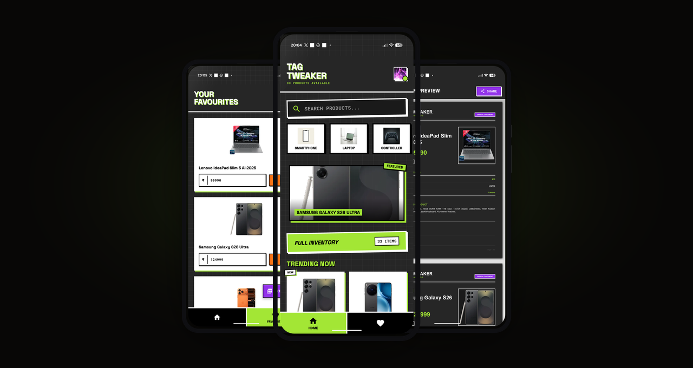
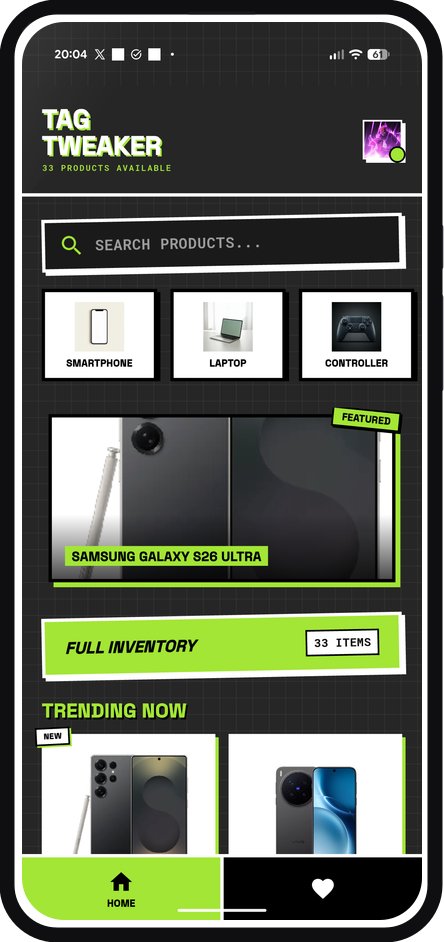
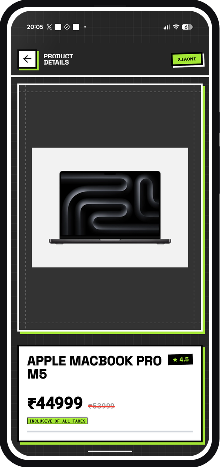
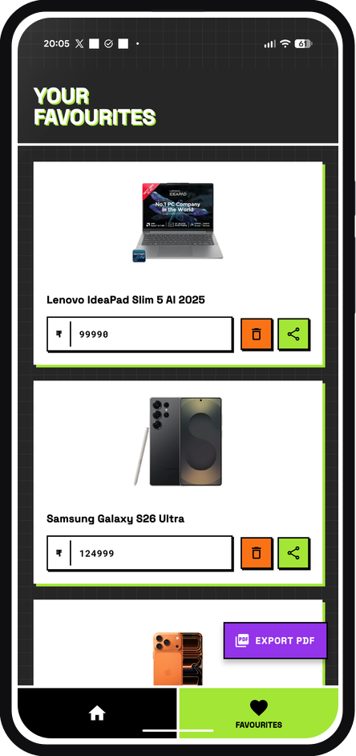
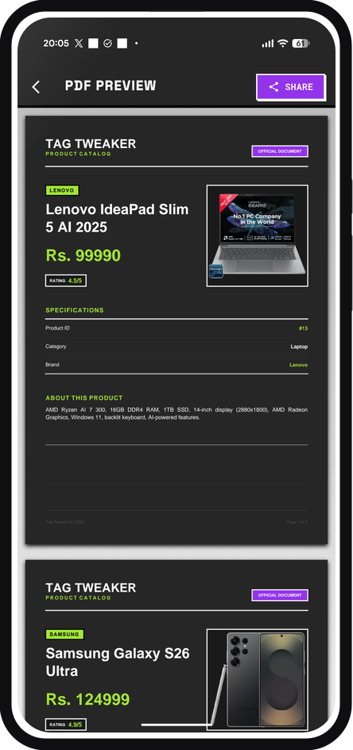

<div align="center">

# 🏷️ Tag Tweaker

**Streamline Product Pricing, Custom Client Quotations & On-Device PDF Catalog Generation**

[](https://flutter.dev)
[](https://firebase.google.com)
[](https://github.com/ChromaBeast/tagtweaker/releases/latest)
[](LICENSE)

<br/>



</div>

---

## ⚡ Overview

**Tag Tweaker** is a bold, high-performance mobile catalog creator built with a distinctive **Neo-Brutalist** aesthetic. Designed for small businesses, retailers, and wholesalers, it allows merchants to browse inventory, customize and tweak product prices for individual client quotations, and compile ready-to-share PDF catalogs directly on-device in under **400ms**.

---

## 📱 App Walkthrough & Screenshots

<div align="center">

| 🏠 Catalog Feed | 📱 Product Details | ⚡ Price Tweaker | 📄 PDF Output |
| :---: | :---: | :---: | :---: |
|  |  |  |  |
| **Catalog Feed**<br/>Fast browsing by category with inventory counts | **Product Details**<br/>Multi-image carousel & deep technical specs | **Price Tweaker**<br/>Curate favorites & tweak client prices in real time | **PDF Output**<br/>On-device vector catalog ready for WhatsApp/print |

</div>

---

## 🚀 Key Features

* **Instant Catalog Browsing**: High-contrast Neo-Brutalist feed with snappy category filtering (Smartphones, Laptops, Audio, Gaming, etc.).
* **Client-Specific Price Tweaking**: Effortlessly customize retail prices per item without altering central database inventories.
* **On-Device Vector PDF Engine**: Compiles customer-ready product catalog PDFs in `<400ms` using a lightweight zero-binary native PDF pipeline (`printing` + `pdf`).
* **Offline-Tolerant & Cached**: Persistent multi-layer image caching with `CachedNetworkImage` and client-side Firestore query pre-warming.
* **50%+ Slashed App Footprint**: Slashed APK bundle size from **55MB+** down to **26.7MB** through ABI splitting, WebP image asset compression, and modular tree-shaking.
* **Modern Android Toolchain**: Powered by **AGP 8.11.1**, **Kotlin 2.2.20**, and **Gradle 8.14.2** with zero deprecation warnings.

---

## 🛠️ Tech Stack

* **Framework:** [Flutter](https://flutter.dev) (Dart 3.x)
* **Architecture & State:** [GetX](https://pub.dev/packages/get) with clean separation of controllers, services, and reusable widgets (< 200 LoC per file)
* **Backend:** [Firebase](https://firebase.google.com) (Authentication, Cloud Firestore, Cloud Storage)
* **Document Engine:** [pdf](https://pub.dev/packages/pdf) & [printing](https://pub.dev/packages/printing)
* **Caching & Networking:** [cached_network_image](https://pub.dev/packages/cached_network_image), [http](https://pub.dev/packages/http)
* **Visual Theme:** Neo-Brutalist design system (custom canvas grid painters, dashed lines, and high-contrast borders)

---

## 📦 Getting Started

### Prerequisites
* Flutter SDK (3.10+)
* Android Studio or VS Code with Flutter extension
* Android SDK 34+

### Installation & Run

```bash
# Clone the repository
git clone https://github.com/ChromaBeast/tagtweaker.git
cd tagtweaker

# Install dependencies
flutter pub get

# Run on connected device
flutter run

# Build split release APKs
flutter build apk --release --split-per-abi
```

---

## 👤 Author

* **ChromaBeast** ([@ChromaBeast](https://github.com/ChromaBeast))
